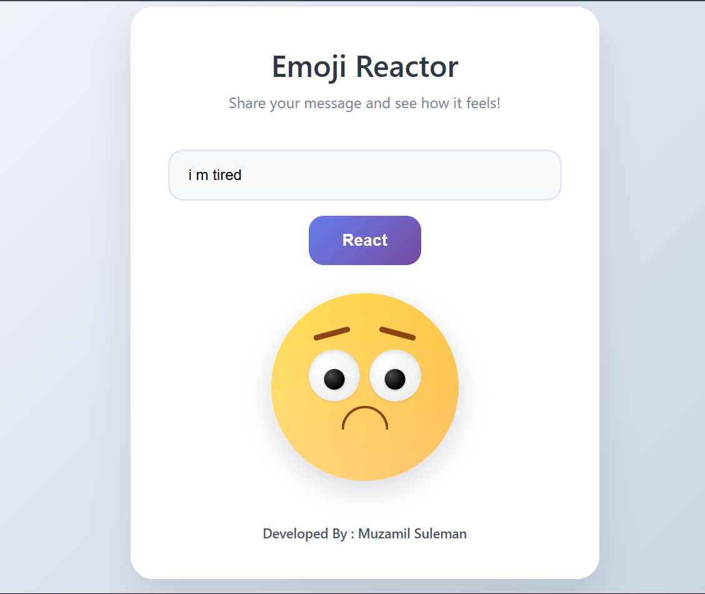

# 😶 Emoji Reactor

A simple and fun web app that reads your **typed message** and reacts with an **appropriate emoji** based on the detected emotion using AI.

**Preview Image**

🌐 **Live Demo**: [Click to Try](https://muzamilalisuleman.github.io/EMOJI-REACTION-AI-INTEGRATED/)

---

## 🧠 How It Works

1. Type any message into the input field.
2. Click **React**.
3. The app uses a basic AI/logic layer to detect the mood of your message.
4. It shows an emoji that reflects how your message *feels*.

---

## ✨ Features

- 🧠 Text-based sentiment/emotion analysis
- 😄 Emoji displayed based on mood
- 🎨 Clean UI with gradient styling
- ⚡ Instant and interactive

---

## 🛠️ Built With

- HTML + CSS
- JavaScript
- Basic NLP or keyword-based logic (no backend required)
- GitHub Pages for deployment

---
